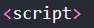
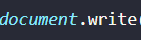
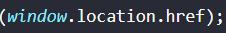
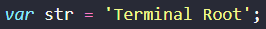
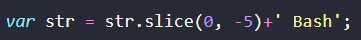
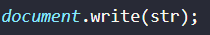

# Projeto Implementando JavaScript

# Introdução 📄

### Neste projeto foi escolhido dois códigos JavaScript para desfragmentá-los e descorrer sobre o que cada elemento faz, sendo assim os códigos escolhidos são:

<<<<<<< HEAD
 - 
 - 
=======
 - 
 - 
>>>>>>> aeb41ffba1b83b65998a7e9be03cbbe8dfe8ba53

### Obs: Os códigos estão embutidos no html, portanto é necessário utilizar a estrutura HTML.

# Desenvolvimento ⚙️

## O que cada elemento do código significa:

## Código 1 👨‍💻

### 

<<<<<<< HEAD
- "script", tag HTML que indica que o conteúdo é um script.
- 

- "Document.write()", método JavaScript que escreve conteúdo na página HTML.
- 

- "window.location.href", acessa a prioridade "href" do objeto "location" do navegador, que contém o URL atual da página.
- 
=======
- "

<<<<<<< HEAD
- "script", Tag HTML que indica que o conteúdo é um script.
- 

- "var str ='Terminal Root'", define uma variável chamada "str" e atribui a ela o valor "Terminal Root".
- 

- "var str = str.slice(0, -5)+"bash"; ", corta os últimos 5 caracteres da string "str" utilizando o método "slice" e concatena "bash" ao resultado, atribuindo esse novo valor á variável "str".
- 

- "document.write(str);", escreve o valor da variável "str" na página HTML. Nesse caso, "Terminal Bash" será escrito na página.
- 
=======
- "<script>", Tag HTML que indica que o conteúdo é um script.
- 

- "var str ='Terminal Root'", define uma variável chamada "str" e atribui a ela o valor "Terminal Root".
- 

- "var str = str.slice(0, -5)+"bash"; ", corta os últimos 5 caracteres da string "str" utilizando o método "slice" e concatena "bash" ao resultado, atribuindo esse novo valor á variável "str".
- 

- "document.write(str);", escreve o valor da variável "str" na página HTML. Nesse caso, "Terminal Bash" será escrito na página.
- 
>>>>>>> aeb41ffba1b83b65998a7e9be03cbbe8dfe8ba53

# Conclusão ✨

### A implementação de JavaScript em website é importante pois desempenha um papel fundamental na criação de websites interativos, dinâmicos e funcionais, melhorando a experiência do usuário e permitindo uma maior interação e personalização.

# Tecnologias Utilizadas 📱💻

[MDN Web Docs](https://developer.mozilla.org/pt-BR/docs/Learn/Getting_started_with_the_web/JavaScript_basics)

[Markdown e Pandoc](http://cursos.leg.ufpr.br/prr/capMarkdown.html#:~:text=Para%20inserir%20uma%20imagem%2C%20a,texto%5D(imagem)%20.)

[Pipz](https://docs.pipz.com/central-de-ajuda/learning-center/guia-basico-de-markdown#open)

[Free Code Camp](https://www.freecodecamp.org/portuguese/news/como-formatar-codigo-em-markdown/)

[DevMedia](https://www.google.com/amp/s/www.devmedia.com.br/amp/javascript-tutorial/37257)

[ChatGpt](https://chat.openai.com/)

[Terminal Root](https://terminalroot.com.br/2016/12/alguns-codigos-simples-de-javascript-2.html)

[Hostinger](https://www.hostinger.com.br/tutoriais/o-que-e-javascript)

[Alura](https://www.alura.com.br/artigos/javascript)
